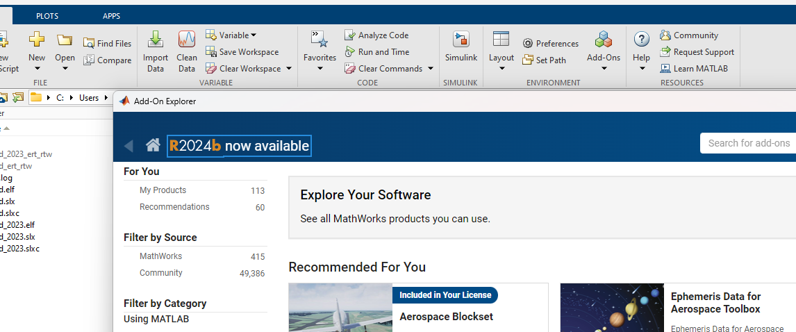

# MATLAB 2024B UAV Toolbox Support Package for PX4 Autopilots Set Up Procedure Windows

Created by: Daniel Fraser
Created time: July 5, 2024 8:08 AM
Parent doc: Guides (https://www.notion.so/Guides-9ead313a910446c4b174fa92544a5aeb?pvs=21)
Tags: Notes

This guide will serve as to aid the set up and instructions to get the PX4 support package set up in a windows based computer. 

The following programs are needed throughout the guide: 

MATLAB2024b 

QGroundControl

WSL (Ubuntu 22.04)

# Step 1.1 - Download MATLAB 2024B

Download MATLAB 2024B from the website below or upgrade from previous generations of MATLAB by going → add ons → clicking on R2024b now available 

[https://www.mathworks.com/downloads/](https://www.mathworks.com/downloads/)

# Step 1.2 - Set up and install Add-Ons

After logging in to the relevant email and username, In the installer or by doing it manually in the “Add-Ons”  tab install the following add ones: 

# Step 1.3 - Get the PX4 support package Add-On

Search for the add on in the Add-On Explorer   

 Click on the tab then install the add on and any dependencies it needs to operate. 

# Step 2.1 - Setting up the PX4 support package

Click the down arrow on Add-Ons and select “Manage add ons” 

Select the three dots by the UAV toolbox support package for PX4 autopilots and select the “set-up” page. 

# Step 2.2 - Installing python dependencies

If Python `3.8.2` is not installed on the computer, select **Automatically Download and install** and click **Next ,** otherwise click validate 

# Step 2.3 Installing WSL and PX4 dependencies

1. Run windows command prompt as administrator:

1. Type the following commands: 

`wsl.exe --update`

Select yes

`wsl --set-default-version 2`

reboot 

`wsl --install Ubuntu-22.04`

Reboot PC

1. Search for WSL in search bar and open: 

1. Log in with a username and password for WSL - you can choose any I just use the following:

Username:WSL 

Password: password

1. Run the following 3 commands in the terminal (if git commands don't’ work run**: sudo apt install git** from command bar) : Replace v1.14.3 section with version required

cd ~ 

`git clone --branch v1.14.3 [https://github.com/PX4/PX4-Autopilot.git](https://github.com/PX4/PX4-Autopilot.git) --recursive`

1. Set up toolchain with the following commands in WSL:

Open wsl then type:

`cd`~/PX4-Autopilot

`cd Tools/setup`

`bash ./ubuntu.sh`

Enter password: password

The the ubuntu.sh build script installs different third-party utilities like GCC 9.3.1, CMake 3.x, Ninja 1.6, Git™, and certain Python packages.

Restart the PC to take affect and complete the set up.

# Step 2.4 Installing QGroundControl

From https://github.com/mavlink/qgroundcontrol/releases/tag/v4.3.0 

Download QGroundControl-installer.exe and run installer set ups. 

# Step 2.5 Completing PX4 set up instructions (back in MATLAB → Repeat Step 1 if closed)

1. Copy the path value and enter it in the edit field in the `Validate PX4 Source code` step of the hardware setup. You can also press browse to look for the PX4-Autopilot folder. 

For our case it would be:

/home/wsl/PX4-Autopilot

Press validate and next.

1. Tick disable controller modules and next.

1. Select from the drop-down menu my board is not listed here.

Then browse for a .px4board file 

Go to holybro → kakuteh7→select default.px4board

Then press next.

1. Select “Use default startup script” then next.

1. Verify QGroundControl installation and press next. 

1. Skip airframe selection by pressing next. 

1. Do not select “Delete PX4 build folder” box and press build firmware. Once the firmware is built press next. 

1.  If the build fails, run the following in wsl:
pip install empy==3.3.4
cd ~/PX4-Autopilot
make distclean
And try rebuild the cmake file from the setup window 
2. Once the firmware builds, complete the rest of the set up window for flashing the board. 
3. Open **device manager** and check what COM port your device is registered as (Kakute boards have a significant delay so this should take +-20s to connect)
    
    
    
4. Read accelerometer data **note**: The Kakute boards have a significant delay in restarting, open **device manager** and wait until the **COM PORT** appears then try read the data from the setup window.

# Step 2.6 Change delay for Kakute boards

1. Go to MATLAB home page: 

 

1. In the file finder place: change **bold** to version you are using.  

C:\ProgramData\MATLAB\SupportPackages\**R2024b**\toolbox\target\supportpackages\px4\core\+codertarget\+pixhawk\+registry

1. Open px4ExtModePreConnect.m
2. Change the pause lines to pause(20)

1. Run: (type and press enter) 

pcode px4ExtModePreConnect 

in the terminal 

1. Go back to the workstation you are using: 

# Step 2.7 Open a Simulink model

1. Open either a blank Simulink model or one of the examples provided. 
2. Go to model settings:

1. Go to hardware implementation and select PX4 Pixhawk Series 

1. The page should show the following: if it doesn’t press **change CMake configuration** to redo the set-up.

1. Click apply 
2. The taskbar should show the following: with **monitor and tune** allowing real time monitoring of data and **build deploy and start** deploying the model onto the flight controller and disconnecting. 

1. In the blank model press **CTRL + SHIFT + L** to open the library  
2. Select the desired PX4 support package blocks from the library to get started for your application or system.

