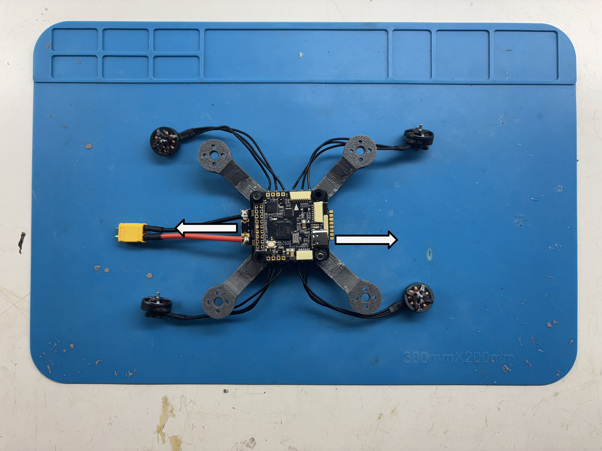

# UCT MicroUAV Attitude test rig hardware setup

This file details the manufacturing, BoM and assembly of the physical platform used as a demonstration and teaching tool in the Introduction to Robotics course.

  
   

## Configurations

There are two possible testing configurations for this quadcopter:

1. 1 Degree of freedom.
    - An M3 screw can be used to constrain the rig so that it can only move with one degree of freedom, being either pitch or roll. This configuration requires a steel ball joint to have a 3mm hole drilled/milled through it, which would require some specialised equipment. Therefore, this configuration may not be available to all.
2. 3 Degrees of freedom
    - Not using the M3 screw through the ball joint will allow the quadcopter to move with three degrees of freedom, namely roll, pitch, and yaw.

## Bill of Materials

Item number | Item Description | Quantity | Units | Supplier | Notes |
| -| - | - | - | - | - |
| 1 | Rig base | 1 | - | 3D print
| 2 | Ball joint female half | 2 | - | 3D print | Internal diameter to be adjusted to steel ball size (test for best fit).
| 3 | Quadcopter frame | 1 | - | 3D print
| 4.1 | T-motor F1203 7000KV motor | 4 | - | [T-motor](https://store.tmotor.com/product/f1203-fpv-motor.html) | 
| 4.2 | M2 x 6 mm socket-hd cap screw | 4 | - | ^ | Included in motor package 
| 4.3 | M2 x 7 mm socket-hd cap screw | 4 | - | ^ | Included in motor package
| 5.1 | Kakute H7 V2 flight stack | 1 | - | [Holybro](https://holybro.com/products/kakute-h7-v2-stacks?variant=41473188298941) | Includes FC, ESC and mounting hardware.
| 5.2 | M3x20 mm pan-hd cap screw | 4 | - | ^ | Included in flight stack package
| 5.3 | M3 nylon lock nuts | 4 | - | ^ | Included in flight stack package
| 5.4 | JST-GH 8-pin x 73 mm connector cable | 1 | - | ^ | Included in flight stack package
| 6 | 2-inch, 3-blade propellers with 2.5" pitch(2CW/2CCW) | 1 | set | [HQ Durable](https://www.team-blacksheep.com/products/product:3113) | Propellers up to 2.5" will fit.
| 7 | M3x40mm socket-hd cap screw | 1 | - | COTS | If 1 DoF testing is required.
| 8 | M3x25mm socket-hd cap screw | 2 | - | COTS | For mounting quadcopter to ball joint.
| 9 | M3 nuts | 2 | - | COTS
| 10 | 16-18 AWG wire - black  | 0.5 | meters | COTS
| 11 | 16-18 AWG wire - red | 0.5 | meters | COTS
| 12 | XT30 M/F pair | 1 | pair | COTS
| 13 | Cheap camera mount ball joint | 1 | - | COTS ([example](https://www.amazon.com/AOQIYUE-Universal-Rotating-Monopods-Camcorder/dp/B08M47S5CW?sr=8-6)) | One with a ~20 mm steel ball on the end of a 1/4-20 thread.

## Additional Equipment

### Powering the quadcopter

The quadcopter can be run on a voltage from 6V to 12.6V. A 12V power supply with over current protection is highly recommended.

With a conservative controller on-board the flight controller, the quadcopter can operate off a 150W power supply (12V@12.5A). However, in this case, it is required that the power supply has built in over current protection. 

If a more agressive controller is to be used, a power supply of up to 400W should be used (12V@33.3A). It is still highly recommended to use a power supply with over current protection because the motors are capable of drawing over 100W each if commanded with a high enough command signal.

### Constraining the platform

There are two options for fastening the rig to a table or desk:

1.  A ~100mm G-clamp can be used as a temporary fastening solution if you are expecting to frequently be moving the platform.
2. There are 4 M4 through holes at the base of the rig that can be used in a more permanent fastening solution.

## Manufacturing

### 3D printing

The three parts that require 3D printing are the base, the ball joint connection and the quadcopter frame. These prints were tested with PLA on Bambu Lab A1 printers, and most of the print settings were stock settings with a 0.2mm layer height and a 0.4mm nozzle. The adjusted settings will be detailed below.

#### Quadcopter frame
- Wall loops: 4
- Top shell layers: 6
- Bottom shell layers: 6
- Infill density: 20%
- Support type: Normal (auto) - snug
- Support threshold angle: 35 degrees
- Support on build plate only: on
- Support top Z distance: 0.17mm
- (Optional if available) Scarf joint: Contour and hole

#### Rig base
- Wall loops: 4
- Infill: 20%
- Enable support: off
- (Optional if available) Scarf joint: Contour and hole
- (Optional if available) Use multi-colour printing to add colour to the text.

#### Ball joint female halves

`The inner diameter of this part may need to be adjusted to ensure smooth operation with the steel ball joint.`

- Wall loops: 4
- Infill: 20%
- Enable support: off
- (Optional if available) Scarf joint: Contour and hole
    - If not available, paint the seam on the external face of the part.

### Ball joint

There is an option for the steel side of the ball joint to have a 3mm hole drilled through its center, if the means are available, to enable the 1 degree of freedom configuration. 

It is important for the hole to be centered on the ball, as well as perpendicular to the threaded shaft. It is therefore reccomended to preform this operation where sufficient precision and accuracy can be achieved, i.e. with a milling machine.

## Assembly steps

### 1. Solder motors to ESC. 

Solder the three motor leads from each motor to the ESC according to the diagram below. The order of the motor wires in each cluster is not important at this stage because the order determines the rotation direction of the motor, which can also be reversed during the ESC calibration and setup procedure. There is also no need to cut down the motor wires to size.

See [here](https://www.youtube.com/watch?v=2funvs3nU7U) for a useful soldering guide specifically for drone components.

### 2. Solder XT30 male to ESC via 18 AWG wire
Solder 50mm of 18 AWG wire to the XT30 male, with red to positive and black to negative. (See [here](https://www.youtube.com/watch?v=2zlw-wo52q8) for help)

Solder the other ends of the above wires to the ESC (red to positive and black to negative).

### 3. Solder the power supply connector
Solder the rest of the 18 AWG wire to the female side of the XT30 connector (red to positive and black to negative).

### 4. Mount Flight Controller/ESC stack to the frame

Add all eight vibration isolators to each of the monting holes on the flight controller and ESC.

Mount flight controller and ESC stack to the frame with two sets of the included M3 screws and nylon lock nuts. 

Tighten the screws until the top of the screw is flush with the top of the nylon lock nut.
    
The orientation of the flight controller with respect to the ESC should be so that the USB-C port and the previously soldered power cable face opposite directions. The orientation of the stack, as a whole, on the frame is not important.

### 6. Mount the motors to the frame
Mount the motors to the frame using the included M2 screws, twisting the motor wires and wrapping them around the arms once before mounting to keep the wires tidy.
    
The T-motor motors come with two lengths of M2 screws. Use the **longer** ones for mounting the motors to the frame.

### 7. Mount the propellers to the motors

Mount the propellers to the motors using the **shorter** M2 screws provided with the motors.

Ensure that the front right propeller wrt. the arrow on the top of the flight controller is set up to rotate CW, with subsequent adjacent motors set up to rotate opposite directions.

### 8. Connect the Flight Controller to the ESC

Use the longer of the two connector cables included with the stack to connect the flight controller to the ESC, wrapping it around the frame arm to keep the cable tidy.

Be sure to connect the ESC to the port on the flight controller containing the signals for motors 1-4. This port is the one closest to the direction arrow on top of the flight controller.

### 9. Screw the steel ball into the top of the Rig base.

### 10. Mount the quadcopter to the steel ball using the ball joint female halves.

Use the M3x25mm socket-hd cap screws and M3 nuts to simultaneously mount the quadcopter to the female ball joint halves, and the female ball joint halves to the steel ball.

### 11. Optionally, use the M3x40mm screw to set up the rig for 1 DoF testing.

Insert the M3x40mm socket-hd cap screw through the entire ball joint assembly, and secure it with a nylon lock nut from the flight controller stack.

There are two opposing pairs of holes in the female part of the ball joint so that the rig can either be set up to be roll-only or pitch-only. With the orientation of the flight stack described in this setup, it is reccomended that the rig is set up to be pitch-only.

