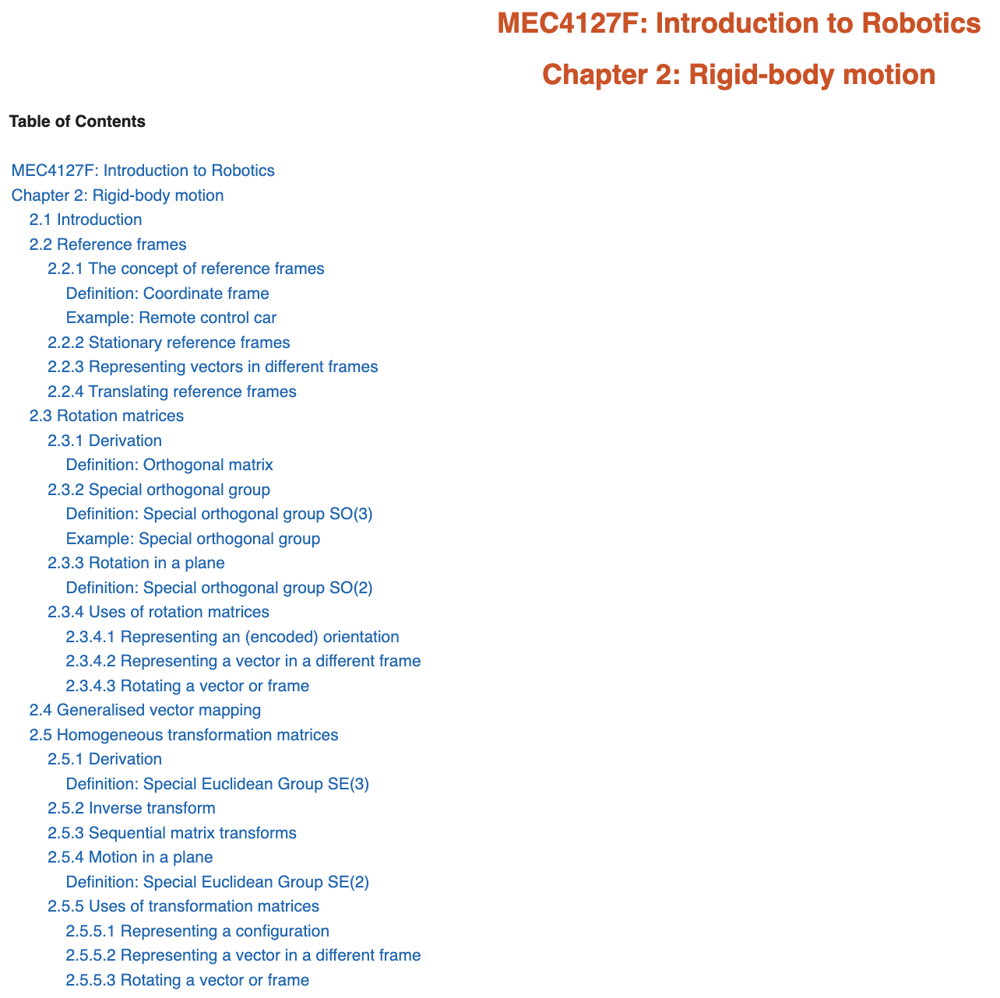
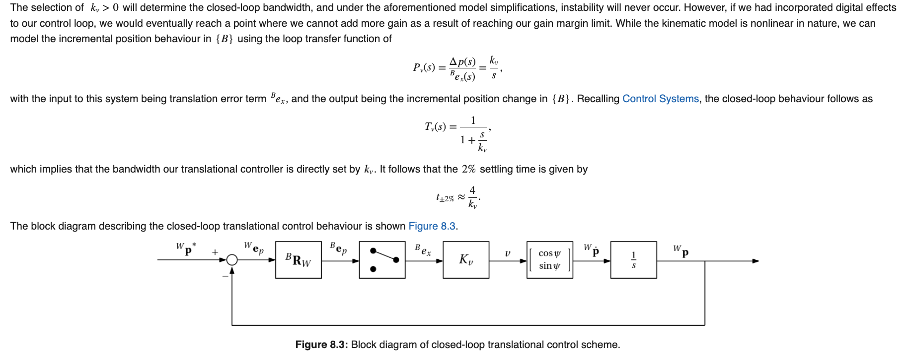
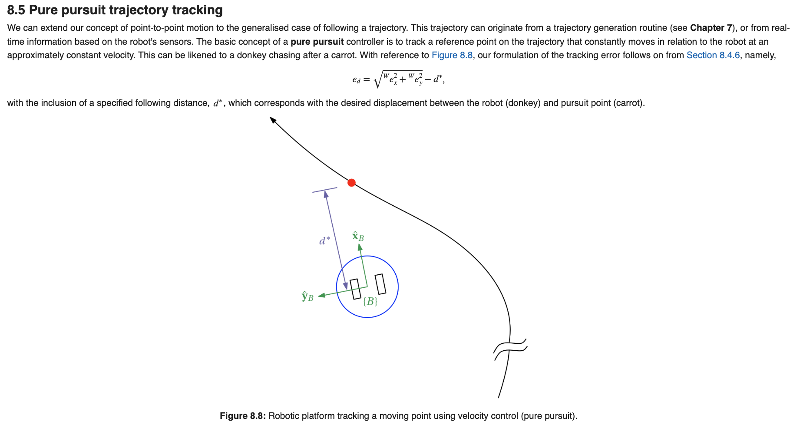
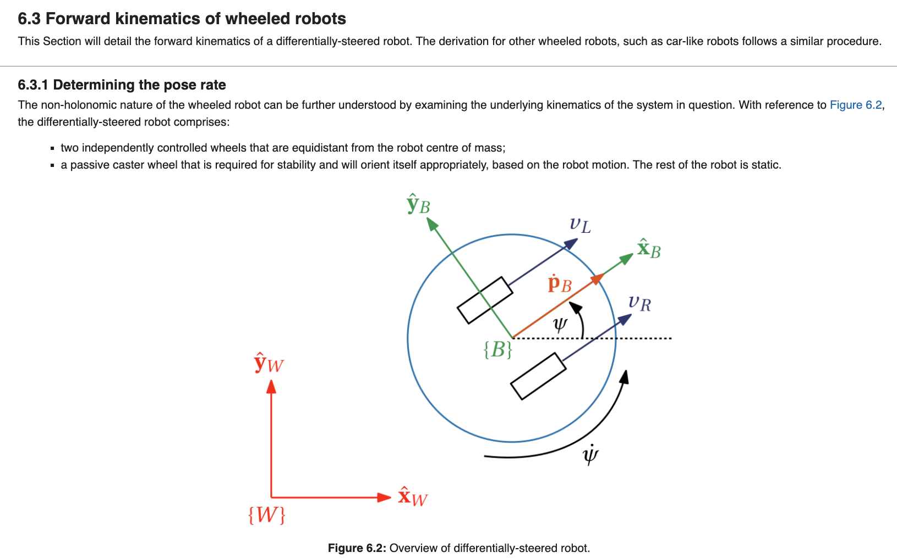
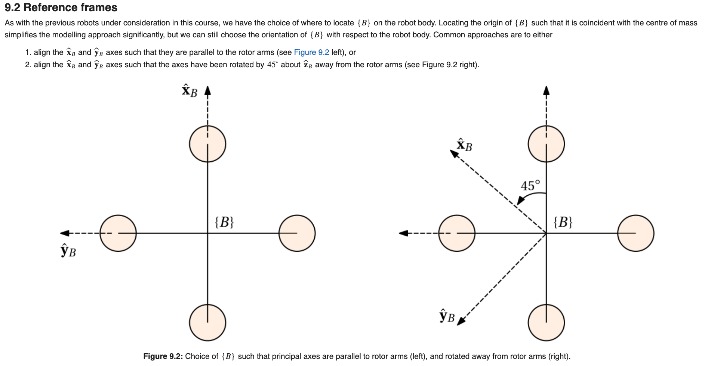
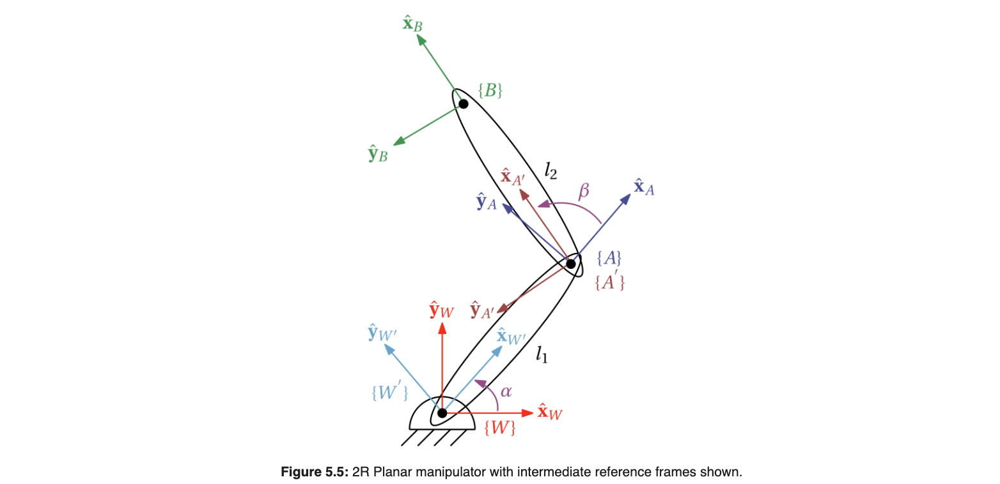
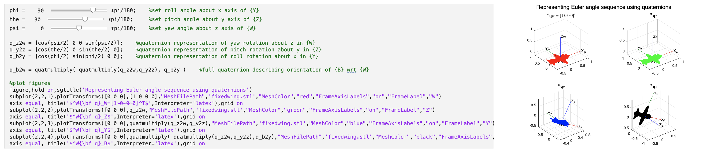

# Introduction-to-Robotics

## Curriculum Module

_Created with MATLAB R2024b. Compatible with MATLAB R2024b and later releases._

2025 © Arnold Pretorius ([Department of Mechanical Engineering, Faculty of Engineering and the Built Environment](https://ebe.uct.ac.za/department-mechanical-engineering), [University of Cape Town](https://www.uct.ac.za))

## Description of content

This teaching package contains content for the course Mechatronic Systems, taught in the Department of Mechanical Engineering at the University of Cape Town, which is based heavily within based in MATLAB [Live Scripts](https://www.mathworks.com/products/matlab/live-editor.html). The teaching package comprises the following:
1. A set of interactive Course Notes, based in MATLAB Live Scripts.
2. A set of Virtual Labs, based in MATLAB Live Scripts.
3. A Project, which is based in MATLAB Live Scripts and Simulink files.
4. A set of Weekly Quizzes, exported in the form of a Brightspace Package, and compatible with the Brightspace Learning Management System.
5. A breakdown of the mechanical design, component selection, and CAD files for a micro-sized quadcopter and attitude test rig.
6. Instructions for setting up the software/firmware required to interface with the quadcopter flight controller.
7. Simulink examples for interacting with and controlling the quadcopter using Monitor and Tune.

The content of this package is intended for undergraduate students with at least some experience with MATLAB, developed by MathWorks. 

The intention of this package is to introduce students to the fundamentals of rigid-body robotics in an interactive manner, providing both rigorous theoretical development, along with guided demonstration and emulated practical exercises. This is made possible by making use of MATLAB Live Scripts which incorporate formatted text, LaTeX equations, imagery, and interactive code blocks. Additionally, optional hardware elements have also been included in this course offering, which can either be used as experimental demonstrations, or incorporated in the Project.

### Important points to take note
- The weekly Virtual Labs contain questions that are meant to be answered within a Learning Management System (LMS), which for the University of Cape Town is Amathuba (an LMS based on D2L Brightspace).
  
- Worked solutions for the Virtual Labs and Project are available and will be provided upon kind request and verification of station.

- Every week there is an auto-marked, online quiz within the LMS, which is intended to gauge the students familiarity with the content from the previous week. While the quizzes are for marks, the students are allowed to attempt the quizzes any number of times and receive instant feedback about their incorrect answers. 

- The University of Cape Town has a Campus Wide License which enables all staff members, students, and visitors to use the full suite of MATLAB products. This allows for easy access to the tools to every students from everywhere in the world. Students can use MATLAB directly in the web browser with MATLAB Online which is connected to MATLAB Drive, which gives every students 20Gb of space in the cloud.

- Students are expected to complete the [MATLAB Onramp](https://matlabacademy.mathworks.com/details/matlab-onramp/gettingstarted) and [Simulink Onramp](https://matlabacademy.mathworks.com/details/simulink-onramp/simulink) before engaging in the Course Notes and Virtual Labs.

## Snapshots of the teaching package

|  Table of contents found in each Chapter |   Combination of static images, formatted text, and LaTeX equations | 
| ----------- | ----------- |

| Numbered and captioned figures with hyperlinked in-text references |   Neatly sectioned and formatted content | 
| ----------- | ----------- |

|   Detailed images |   Annotated figures | 
| ----------- | ----------- |

|   Interactive code blocks and detailed visualisations   |
| ----------- |

## Instructions

The course content can be approached in one of two ways:
1. Click on . This will allow you to access the content online in your web browser through MATLAB Online.
2. Download all files and access the content from the MATLAB desktop application.

### Live Scripts

The Live Scripts course notes are presented as an interactive textbook with numbered sections. 

Live Scripts are divided into sections and contain interactive Live Script controls which include buttons, checkboxes, sliders, and dropdown menus. Feel free to interact with these controls as well as typing in your own code snippets. You can run each section within a Live Script individually. 

The Live Scripts are intended to be executed in sections. This can be achieved by pressing the Run Section button within the MATLAB interface, or using CNTRL/CMD+ENTER. 

### Learning Goals
The objective of this module is to provide an introduction to mobile robotics. This comprises:
- Developing an understanding of reference frames and vector mappings
- Understanding and applying rigid-body motion
- Representing the position and orientation of a rigid body
- Estimating the pose of a robot using on-board sensor information
- Deriving the forward and inverse kinematics of robot arms
- Deriving the forward and inverse kinematics of wheeled robots
- Determining and applying different trajectory generation schemes
- Designing a controller for wheeled robots
- Modelling the dynamics of a quadcopter
- Designing attitude and position controllers for a quadcopter

## Course Notes and Assessments
This section details the course notes and assessments that are present in this teaching package. The Course Notes and Virtual Labs are based in Live Scripts, whereas the Project is based in both Live Scripts and Simulink. 
The Quizzes are in the form of Brightspace packages, which can be seamlessly imported into a Brightspace-compatible learning management system. The Quizzes can also be shared as Common Cartridges upon kind request.

### Course Notes
- Chapter 1 - Introduction
- Chapter 2 - Rigid-body motion
- Chapter 3 - Orientation and angular velocity
- Chapter 4 - Pose estimation
- Chapter 5 - Robot arm kinematics
- Chapter 6 - Wheeled robot kinematics
- Chapter 7 - Trajectory generation
- Chapter 8 - Control design for wheeled robots
- Chapter 9 - Quadcopter dynamics
- Chapter 10 - Attitude control design for quadcopters
- Chapter 11 - Position control design for quadcopters
  
### Virtual Labs
- Virtual Lab 1 - Reference frames and vectors
- Virtual Lab 2 - Orientation and angular velocity
- Virtual Lab 3 - Quaternions and exponential coordinates
- Virtual Lab 4 - Orientation estimation
- Virtual Lab 5 - Robot arm forward kinematics
- Virtual Lab 7 - Robot arm inverse kinematics
- Virtual Lab 8 - Trajectory generation
- Virtual Lab 9 - Wheeled robot control

### Project
- Project, Part 1 - Orientation estimation using an explicit complementary filter
- Project, Part 2 - Attitude control design of a quadcopter

### Quizzes
- Quiz 1 — Rotation matrices and vectors
- Quiz 2 — Transformation matrices, Euler angles, and quaternions
- Quiz 3 — Quaternions and exponential coordinates
- Quiz 4 — Inertial measurement units
- Quiz 5 — Orientation estimation
- Quiz 6 — Robot arm kinematics
- Quiz 7 — Wheeled robot kinematics
- Quiz 8 — Trajectory generation
- Quiz 9 — Control design for wheeled robots
- Quiz 10 — Quadcopter dynamics
- Quiz 11 — Control design for quadcopter

## Hardware
This section details the hardware elements of the teaching package, as well as the associated installation instructions and example scripts. The course is configured such that inclusion of the hardware is purely optional, based on the resources available for the particular university. 

### Mechanical Design and Assembly
- CAD files for the quadcopter frame and attitude rig
- A [README](Hardware/Mechanical%20Design%20and%20Assembly/README.md) detailing the manufacturing, bill of materials, and assembly of the physical platform

### Experimental Data
- Experimental data of the motor-propeller thrust behaviour is included for the purposes of model-based analysis and control design

### Installation
- A [README](Hardware/README.md) detailing the installation instructions for setting up the MATLAB-PX4 integration in order to use Simulink External Mode with the flight controller. 

### Examples
- Explicit complementary filter running on flight controller using Monitor and Tune
- Roll controller running on flight controller using Monitor and Tune

## Suggested Prerequisites

This course requires a strong basis in vector calculus, linear algebra, mechanics, and control systems, and is mainly suited to a student with a mechatronics background.

## Additional Resources

### Introduction to MATLAB

[MATLAB Onramp](https://matlabacademy.mathworks.com/details/matlab-onramp/gettingstarted) - Learn the essentials of MATLAB through this free, two-hour introductory tutorial on commonly used features and workflows.

[Simulink Onramp](https://matlabacademy.mathworks.com/details/simulink-onramp/simulink) - Learn the basics of how to create, edit, and simulate models in Simulink®. Use block diagrams to represent real-world systems and simulate components and algorithms.

### Educator Resources
We invite educators interested in this course material to go through the resources links provided below:
- [Featured Courseware](https://www.mathworks.com/academia/courseware/course-materials.html)
- [Teach with MATLAB and Simulink](https://www.mathworks.com/academia/educators.html)
- Feel free to contact me with your feedback, my email is [arnold.pretorius@uct.ac.za](mailto:arnold.pretorius@uct.ac.za)

## Products

### Required for course notes and assessments
- [MATLAB](https://www.mathworks.com/products/matlab.html), 
- [Symbolic Math Toolbox™](https://www.mathworks.com/products/symbolic.html),
- [Control System Toolbox](https://www.mathworks.com/products/control.html),
- [Robotic System Toolbox](https://in.mathworks.com/products/robotics.html),
- [Simulink™](https://www.mathworks.com/products/simulink.html),
- [UAV Toolbox](https://www.mathworks.com/products/uav.html).

### Required for interfacing with hardware
- [Embedded Coder](https://in.mathworks.com/products/embedded-coder.html),
- [MATLAB Coder](https://in.mathworks.com/products/matlab-coder.html),
- [Simulink Coder](https://in.mathworks.com/products/simulink-coder.html),
- [UAV Toolbox Support Package for PX4 Autopilots](https://in.mathworks.com/help/uav/px4-spkg.html).

## License

The license for this module is available in the [LICENSE](LICENSE) file in this repository.

## Acknowledgments
Special thanks to my postgraduate students — Alyssa Ramwell, Daniel Fraser, Guy Hasewinkel, and Luke Richardson — who were instrumental in the preparation and running of this course!

This Curriculum Module was developed through the support of [MathWorks](https://www.mathworks.com/). 
I would also like to express my gratitude to Dr. Marco Rossi, Dr. Moiz Khan, and Dr Pranav Lad from [MathWorks](https://www.mathworks.com/), who very kindly assisted with reviewing this content and providing valuable suggestions.
